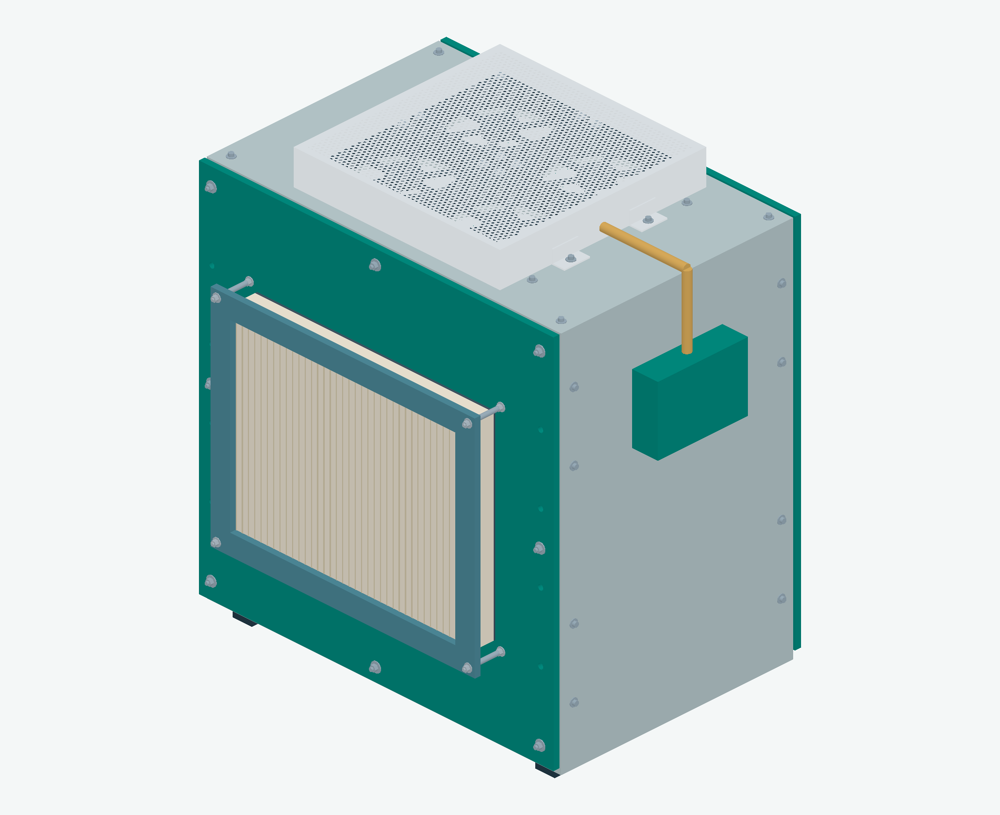
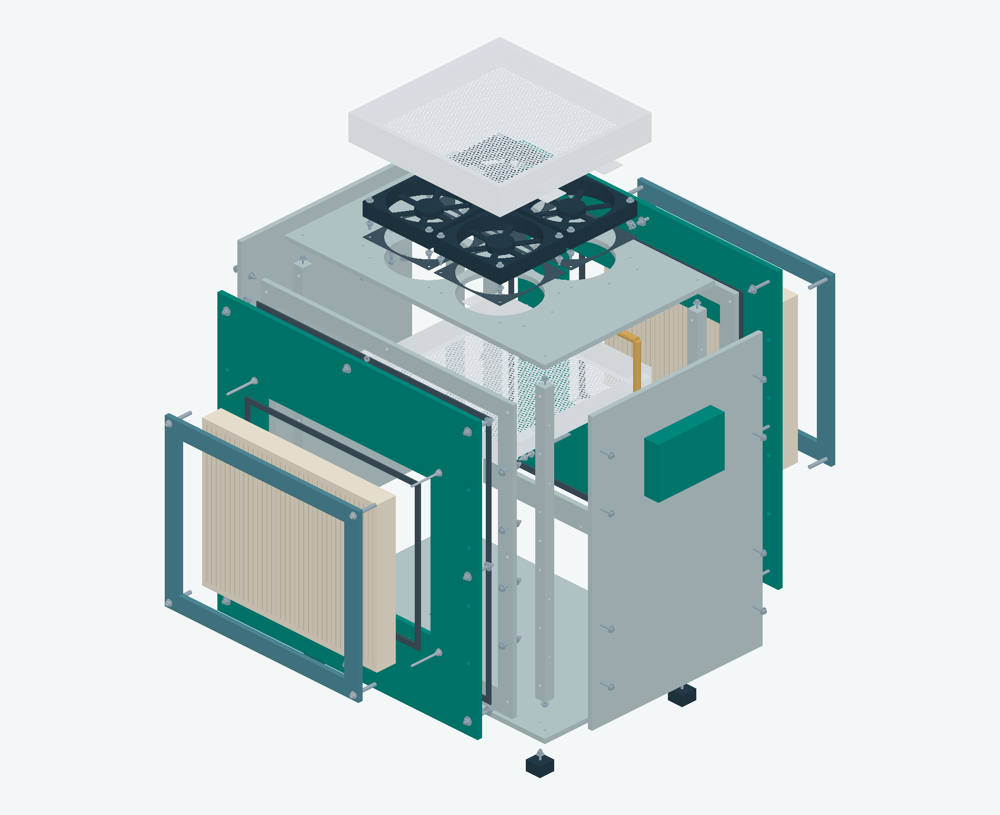
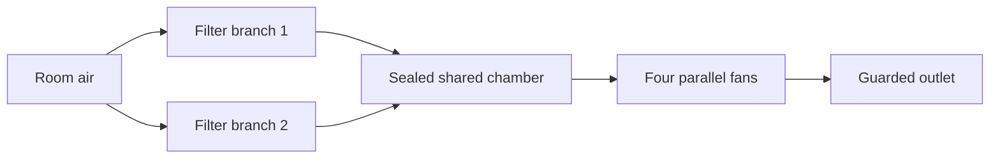

# AQI Tower

AQI Tower is a student engineering project developing a fan-and-filter air cleaner. We are preparing a small indoor prototype before investigating a larger outdoor cylindrical tower.

**Current stage:** internal engineering review. **Physical prototypes built: 0.** The design still needs mechanical and electrical release before construction.

## See the current design



*Rendering of our current CAD assembly, not a photograph of a built machine. The side control box and yellow cable route reserve space; electrical hardware and protected cable entry are unfinished. Guard holes are illustrated in the rendering but are not cut into the native CAD faces.*



*The exploded view shows how the cabinet, filters, fan plate, guards and hardware fit together. It is a design-review view; welds, threads, tolerances, strength and sealing still need assessment.*

## Start here

| Reader | Open first |
| --- | --- |
| Stakeholder or new team member | [Three-page stakeholder brief](reports/prototype_d01/internal_handoff_20261005/01_STAKEHOLDER_BRIEF.pdf) |
| Mechanical or electrical engineer | [Engineering review and drawings, 41 pages](reports/prototype_d01/internal_handoff_20261005/03_ENGINEERING_DRAWINGS_AND_REVIEW.pdf) |
| Team receiving the complete package | [Download IH02 ZIP](reports/prototype_d01/internal_handoff_20261005/AQI_TOWER_INTERNAL_HANDOFF_IH02.zip) and [package instructions](reports/prototype_d01/internal_handoff_20261005/START_HERE.md) |
| Person budgeting the build | [Parts register](reports/prototype_d01/internal_handoff_20261005/COMBINED_PARTS_REGISTER.csv) and [quote worksheet](reports/prototype_d01/internal_handoff_20261005/QUOTE_AND_FUNDING_REGISTER.csv) |
| Engineer recording decisions | [Review and release register](reports/prototype_d01/internal_handoff_20261005/REVIEW_AND_RELEASE_REGISTER.csv) |

**IH02, dated 5 October 2026, is the current handoff.** Use mechanical revision **R03M**. Older R00/R01/R02 handoffs and full-size tower studies remain historical evidence; do not combine their filter, fan, wiring or drilling assumptions with this prototype.

## How the first prototype works

Two removable particle filters feed a shared chamber. Four fans move air through it and out through the top guard. The filters are parallel branches, not successive filtration stages.



The current concept uses four **ARCTIC P14 Max ACFAN00287A** fans and two experimental **IKEA STARKVIND 104.633.30** filter envelopes. IKEA specifies these replacement filters for its STARKVIND appliances; our custom integration has not been endorsed or validated by IKEA. The completed device has no verified HEPA classification.

An external **12 V Noctua power adapter** and OEM fan controller/hub form the electrical reference. Rated protection, isolation, enclosure and harness details remain open. Read the [electrical review](reports/prototype_d01/electrical_package/README.md) before using any schematic.

## What the evidence establishes

| Evidence | What we can say |
| --- | --- |
| CAD and drawings | An integrated assembly, exploded view, panel layouts and proposed hardware exist. Nominal fit checks do not establish manufacturing tolerances, strength or safe access. |
| Fan and pressure calculations | At an assumed 300 m³/h total, the current K1 scenario leaves about **14.32 Pa per filter**. This is conditional headroom under unverified loss assumptions, not actual flow or measured filter resistance. |
| Analysis software | Arithmetic and abstract control checks run. They do not certify hardware or establish physical performance. |
| Physical tests | No complete prototype has been built or measured in the reviewed project records. |
| Future outdoor zones | Bubble radius, removal percentage and tower spacing remain unproven. Indoor results cannot establish outdoor coverage. |

The historical sealed-filter CFD predicted approximately 1,332 m³/h for a different tower geometry and was partial/nonconverged. It does not validate D01. Carbon adsorption, solar assistance and outdoor deployment remain separate development work.

## What remains before building

- Confirm actual filter resistance, frame tolerances and seal behaviour.
- Finish guard strength/access, cabinet joints, stability and service details.
- Complete rated electrical protection, isolation, enclosure and wiring.
- Resolve cable dimensions requested from ARCTIC and Noctua; [enquiries are sent](docs/build/OEM_CABLE_ENQUIRIES.md).
- Agree the indoor test site and acceptance targets, obtain real quotes, then release parts and fabrication.
- Assemble, inspect, commission and measure airflow, pressure, particles, noise and power.

Internal mechanical and electrical review can proceed while manufacturer replies are pending. Use the [current release register](reports/prototype_d01/internal_handoff_20261005/REVIEW_AND_RELEASE_REGISTER.csv) to record decisions and supporting evidence.

## Repository map

| Location | Purpose |
| --- | --- |
| [Current handoff](reports/prototype_d01/internal_handoff_20261005/START_HERE.md) | Coordinated team package and current tools |
| [Mechanical package](reports/prototype_d01/mechanical_package/README.md) | Base assembly, drawings, guards, fasteners, seals and service evidence |
| [Harness study](reports/prototype_d01/mechanical_package/harness_detail/README.md) | Cable reservations and unresolved entry details |
| [Electrical package](reports/prototype_d01/electrical_package/README.md) | OEM reference chain, power budget and protective-control decisions |
| [Validation package](reports/prototype_d01/validation_package/README.md) | Physical-test preparation and corrected analysis instructions |
| [Project status](memory/project_status.md) | Dated continuation record |
| [Build starting point](docs/build/START_HERE.md) | Current and historical build context |
| [Project overview](docs/PROJECT_OVERVIEW.md) | Purpose and development phases |
| [Requirements](requirements/REQUIREMENTS.md) | Engineering requirements and assumptions |
| [Environment](docs/ENVIRONMENT.md) | Recorded computer and software setup |
| `cad/`, `cfd/`, `data/`, `results/` | Historical models, solver inputs, source data and curated results |
| `scripts/` | Geometry generation, analysis, monitoring and report builders |
| `threejs/` | Browser-based engineering viewer |

## Getting started

```bash
git clone https://github.com/Naks-bro/AQI-TOWER.git
cd AQI-TOWER
```

For documentation, start with the PDFs above. FreeCAD opens the [current native assembly](reports/prototype_d01/mechanical_package/D01_R03M_ASSEMBLY.FCStd); a [STEP export](reports/prototype_d01/mechanical_package/D01_R03M_ASSEMBLY.step) is also available. These files are for review.

Current analysis checks use Python 3 and the standard library:

```bash
python scripts/analysis/d01_validation.py
python scripts/analysis/d01_guard_bending.py
python scripts/analysis/d01_control_acceptance.py
python -m unittest discover -s scripts/analysis -p test_d01_current_filter_screen.py -v
python scripts/maintenance/check_readme_links.py
```

Read [tool usage](reports/prototype_d01/internal_handoff_20261005/TOOL_USAGE.md) before analysing measurements. Keep raw observations unchanged, identify calibration/source references, and label synthetic fixtures clearly. Rebuilding CAD or PDF reports requires additional software documented with the relevant builder; the small checks above do not.

To run the existing viewer:

```bash
cd threejs
npm ci
npm run dev
```

OpenFOAM/ParaView workflows belong to their documented historical studies. Do not treat running an old solver case as validation of the current physical assembly.

## Contributing

Use one branch and PR for one meaningful change. Describe the problem, affected revision, checks performed and remaining limitations. Follow the [PR template](.github/pull_request_template.md), update [CHANGELOG.md](CHANGELOG.md), and update this README when the current handoff, status or onboarding workflow changes.

Keep facts, assumptions, digital predictions and physical measurements distinct. Preserve historical files and raw observations. Do not commit credentials, private correspondence, generated solver time directories, `node_modules` or local inspection screenshots. The current downloadable handoff is intentionally tracked; other redundant report ZIPs remain local.

**AQI Tower is a working name.** The final device name has not been selected. This repository does not claim verified outdoor coverage or patentability.
