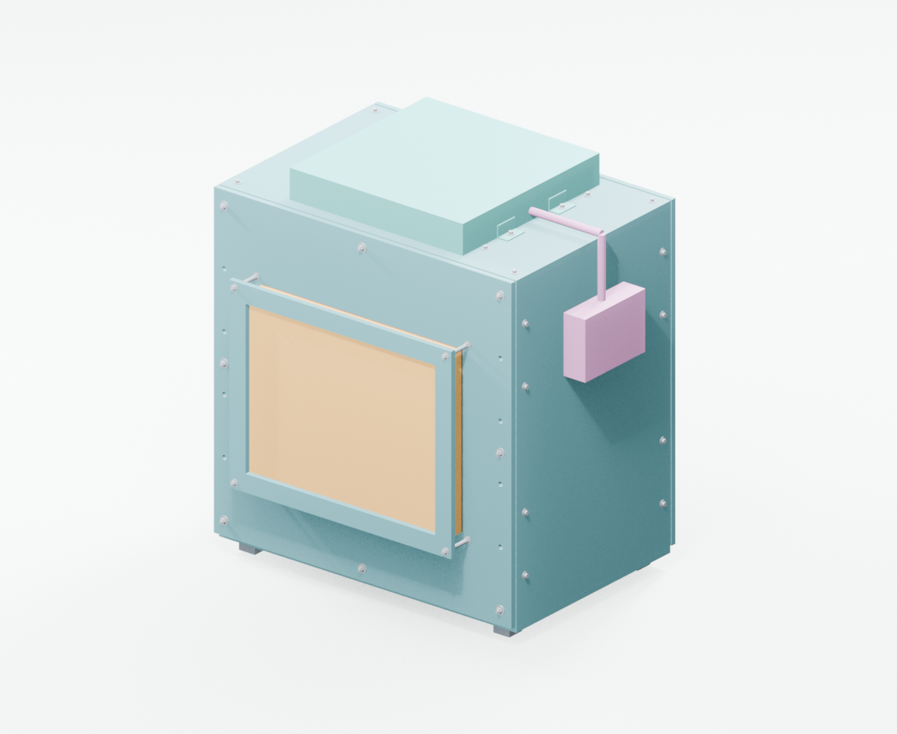
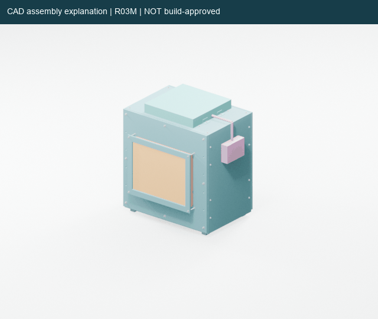
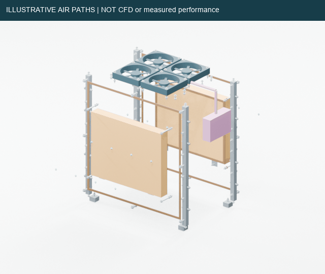
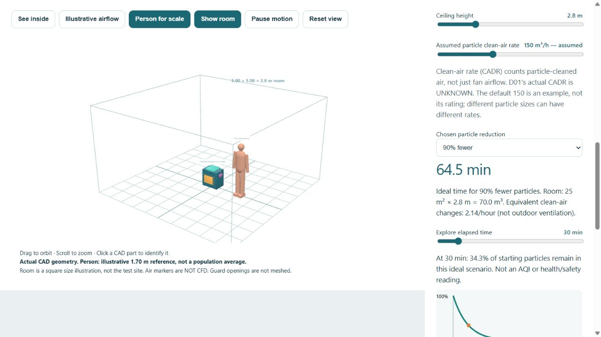
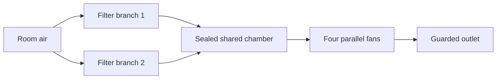

# AQI Tower

AQI Tower is a student engineering project developing a fan-and-filter air cleaner. We are preparing a small indoor prototype before investigating a larger outdoor cylindrical tower.

**Current stage:** internal engineering review. **Physical prototypes built: 0.** The design still needs mechanical and electrical release before construction.

Latest mechanical calculation: [mass and stability supplement](reports/prototype_d01/mechanical_package/MASS_STABILITY_REVIEW.md). Actual guard-hole drawings and published fan weights give a **12.61 kg partial assumed assembly**, not finished tower weight. Filters, feet, seals and controls remain unweighed; no stability approval. Includes reproducible calculations and six synthetic tests.

Latest electrical calculation: [four-page power and wiring supplement](reports/prototype_d01/electrical_package/AQI_D01_POWER_AND_WIRING_SUPPLEMENT.pdf). OEM connector-level reference, verified fan pin functions, 20 load and 36 conditional wire-drop scenarios; ten synthetic tests. Rated restart/protection, actual conductor/fuse selection and enclosure remain open. Do not energize the incomplete circuit.

Implemented ordinary-control candidate: [Opta bench drawing](reports/prototype_d01/electrical_package/AQI_D01_OPTA_BENCH_REVIEW.pdf) and [C++ firmware / source evidence](firmware/d01_opta_review/README.md).1,041 host assertions pass; default firmware also compiles for the real Opta target using official core4.6.0 / CLI1.5.1. [Reproducible board-build evidence](reports/prototype_d01/electrical_package/OPTA_BOARD_BUILD.json). Hardware testing NOT DONE. Relay outputs disabled by default. Not a protective controller or released fan wiring; PR1 remains open. Separate external-box and fuse-coordination screens included in the technical ZIP.

## See the current design



*Blender rendering imported from the actual 493-object R03M CAD assembly, not a photograph. Purple parts reserve control/cable space; electrical hardware and protected cable entry are unfinished. The guard faces are solid CAD envelopes: the proposed perforations are not meshed.*



*The exploded view shows how the cabinet, filters, fan plate, guards and hardware fit together. It is a design-review view; welds, threads, tolerances, strength and sealing still need assessment.*



*Hand-authored air markers explain the intended path. This animation is NOT CFD, measured airflow or proof of cleaning. Existing historical CFD remains separately labelled in the technical report.*



*The viewer includes a 1.70 m illustrative person and adjustable room area/ceiling height, assumed particle clean-air rate, reduction goal and time. The model predicts ideal particle decay under explicit assumptions, NOT actual D01 performance or safe occupancy. Actual CADR remains unknown. See [room model basis](reports/shareable_20261005/technical/ROOM_MODEL_BASIS.md).*

## Start here

| Reader | Open first |
| --- | --- |
| Stakeholder or new team member | [8-page Executive Summary + Comprehensive Report](reports/shareable_20261005/stakeholder/AQI_TOWER_STAKEHOLDER_REPORT.pdf) or [complete stakeholder ZIP](reports/shareable_20261005/AQI_TOWER_STAKEHOLDER_BUNDLE.zip) |
| Mechanical or electrical engineer | [50-page technical handoff](reports/shareable_20261005/technical/AQI_TOWER_TECHNICAL_HANDOFF.pdf) or [complete technical ZIP](reports/shareable_20261005/AQI_TOWER_TECHNICAL_BUNDLE.zip) |
| Person budgeting the build | [Funding workbook](reports/shareable_20261005/stakeholder/STAKEHOLDER_FUNDING.xlsx); prices and stock remain unknown until quoted |
| Engineer recording decisions | [Technical review workbook](reports/shareable_20261005/technical/TECHNICAL_REVIEW.xlsx), including parts, release, pressure and hardware sheets |
| Anyone exploring the design | [Offline 3D viewer](reports/shareable_20261005/AQI_TOWER_3D_REVIEW.html), with Simple and Technical views, cutaway, part inspection and explosion controls; download and open in a WebGL browser |
| Blender user | [Editable CAD-derived presentation](reports/shareable_20261005/visuals/AQI_R03M_REVIEW.blend), not a manufacturing model |

**The shareable delivery, dated 5 October 2026, preserves IH02 / mechanical R03M evidence and adds current calculation supplements.** The technical PDF preserves the [41-page IH02 reference](reports/prototype_d01/internal_handoff_20261005/03_ENGINEERING_DRAWINGS_AND_REVIEW.pdf) after a five-page introduction, followed by the four-page E01 electrical supplement. See [delivery instructions](reports/shareable_20261005/README.md). Older R00/R01/R02 handoffs and full-size tower studies remain historical evidence; do not combine their filter, fan, wiring or drilling assumptions with this prototype. This is an engineering-review update, not a build release.

## How the first prototype works

Two removable particle filters feed a shared chamber. Four fans move air through it and out through the top guard. The filters are parallel branches, not successive filtration stages.



The current concept uses four **ARCTIC P14 Max ACFAN00287A** fans and two experimental **IKEA STARKVIND 104.633.30** filter envelopes. IKEA specifies these replacement filters for its STARKVIND appliances; our custom integration has not been endorsed or validated by IKEA. The completed device has no verified HEPA classification.

An external **12 V Noctua power adapter** and OEM fan controller/hub form the electrical reference. Rated protection, isolation, enclosure and harness details remain open. Read the [electrical review](reports/prototype_d01/electrical_package/README.md) before using any schematic.

## What the evidence establishes

| Evidence | What we can say |
| --- | --- |
| CAD and drawings | An integrated assembly, exploded view, panel layouts and proposed hardware exist. Nominal fit checks do not establish manufacturing tolerances, strength or safe access. |
| Fan and pressure calculations | At an assumed 300 m³/h total, the current K1 scenario leaves about **14.32 Pa per filter**. This is conditional headroom under unverified loss assumptions, not actual flow or measured filter resistance. |
| Analysis software | Arithmetic and abstract control checks run. They do not certify hardware or establish physical performance. |
| Physical tests | No complete prototype has been built or measured in the reviewed project records. |
| Future outdoor zones | Bubble radius, removal percentage and tower spacing remain unproven. Indoor results cannot establish outdoor coverage. |

The historical sealed-filter CFD predicted approximately 1,332 m³/h for a different tower geometry and was partial/nonconverged. It does not validate D01. Carbon adsorption, solar assistance and outdoor deployment remain separate development work.

## Intended targets and room sizing

The first prototype aims to reduce airborne particles such as dust and fine smoke particles (PM2.5/PM10), not smoke gases. Actual particle capture and room reduction are unmeasured. No CO₂/CO, VOC/odour, bacteria/virus-control or health-protection performance is established. Filtration does not replace ventilation and source control.

The viewer's example 25 m² room × 2.8 m ceiling has 70 m³ of air. At **assumed**, not measured, 150 m³/h particle-cleaned flow, the ideal 90% reduction time is 64.5 min. A 90% goal in 30 min instead requires 322.4 m³/h effective clean air. Even perfect capture at the **assumed 300 m³/h airflow** screening point cannot meet that target. This calculation helps choose realistic test requirements; it does not establish a room rating. Sources and no-source/perfect-mixing limitations are in [the model basis](reports/shareable_20261005/technical/ROOM_MODEL_BASIS.md).

## What remains before building

- Confirm actual filter resistance, frame tolerances and seal behaviour.
- Finish guard strength/access, cabinet joints, stability and service details.
- Complete rated electrical protection, isolation, enclosure and wiring.
- Resolve cable dimensions requested from ARCTIC and Noctua; [enquiries are sent](docs/build/OEM_CABLE_ENQUIRIES.md).
- Agree the indoor test site and acceptance targets, obtain real quotes, then release parts and fabrication.
- Assemble, inspect, commission and measure airflow, pressure, particles, noise and power.

Internal mechanical and electrical review can proceed while manufacturer replies are pending. Use the [current release register](reports/prototype_d01/internal_handoff_20261005/REVIEW_AND_RELEASE_REGISTER.csv) to record decisions and supporting evidence.

## Repository map

| Location | Purpose |
| --- | --- |
| [Current handoff](reports/prototype_d01/internal_handoff_20261005/START_HERE.md) | Coordinated team package and current tools |
| [Mechanical package](reports/prototype_d01/mechanical_package/README.md) | Base assembly, drawings, guards, fasteners, seals and service evidence |
| [Harness study](reports/prototype_d01/mechanical_package/harness_detail/README.md) | Cable reservations and unresolved entry details |
| [Electrical package](reports/prototype_d01/electrical_package/README.md) | OEM reference chain, power budget and protective-control decisions |
| [Validation package](reports/prototype_d01/validation_package/README.md) | Physical-test preparation and corrected analysis instructions |
| [Project status](memory/project_status.md) | Dated continuation record |
| [Build starting point](docs/build/START_HERE.md) | Current and historical build context |
| [Project overview](docs/PROJECT_OVERVIEW.md) | Purpose and development phases |
| [Requirements](requirements/REQUIREMENTS.md) | Engineering requirements and assumptions |
| [Environment](docs/ENVIRONMENT.md) | Recorded computer and software setup |
| `cad/`, `cfd/`, `data/`, `results/` | Historical models, solver inputs, source data and curated results |
| `scripts/` | Geometry generation, analysis, monitoring and report builders |
| `threejs/` | Browser-based engineering viewer |

## Getting started

```bash
git clone https://github.com/Naks-bro/AQI-TOWER.git
cd AQI-TOWER
```

For documentation, start with the PDFs above. FreeCAD opens the [current native assembly](reports/prototype_d01/mechanical_package/D01_R03M_ASSEMBLY.FCStd); a [STEP export](reports/prototype_d01/mechanical_package/D01_R03M_ASSEMBLY.step) is also available. These files are for review.

Current analysis checks use Python 3 and the standard library:

```bash
python scripts/analysis/d01_validation.py
python scripts/analysis/d01_guard_bending.py
python scripts/analysis/d01_control_acceptance.py
python -m unittest discover -s scripts/analysis -p test_d01_current_filter_screen.py -v
python scripts/maintenance/check_readme_links.py
python scripts/maintenance/check_shareable_delivery.py
```

Read [tool usage](reports/prototype_d01/internal_handoff_20261005/TOOL_USAGE.md) before analysing measurements. Keep raw observations unchanged, identify calibration/source references, and label synthetic fixtures clearly. Rebuilding CAD or PDF reports requires additional software documented with the relevant builder; the small checks above do not.

For the new presentation viewer, extract either bundle and open `AQI_TOWER_3D_REVIEW.html`. No installation, server or internet is required; WebGL is required. GitHub previews do not run the HTML application. Both audiences can use the same model with different explanations.

To run the historical GEO_C engineering viewer (different geometry):

```bash
cd threejs
npm ci
npm run dev
```

OpenFOAM/ParaView workflows belong to their documented historical studies. Do not treat running an old solver case as validation of the current physical assembly.

## Contributing

Use one branch and PR for one meaningful change. Describe the problem, affected revision, checks performed and remaining limitations. Follow the [PR template](.github/pull_request_template.md), update [CHANGELOG.md](CHANGELOG.md), and update this README when the current handoff, status or onboarding workflow changes.

Keep facts, assumptions, digital predictions and physical measurements distinct. Preserve historical files and raw observations. Do not commit credentials, private correspondence, generated solver time directories, `node_modules` or local inspection screenshots. Current downloadable handoff/bundle ZIPs are intentionally tracked; redundant old report ZIPs remain local.

## What is on GitHub

Project sources, curated engineering evidence, current CAD/drawings, results, reports, workbooks, final visuals and downloadable bundles are tracked. This is not a byte-for-byte mirror of every local file. Approximately 1.75 GB of generated raw solver fields/meshes/logs, dependencies, scratch work and old recordings remain local; nothing was deleted. The [coverage inventory](reports/shareable_20261005/GITHUB_COVERAGE.csv) records excluded categories and readable sizes, including inaccessible WSL links. Existing source cases and curated CFD results remain preserved in the repository.

**AQI Tower is a working name.** The final device name has not been selected. This repository does not claim verified outdoor coverage or patentability.
