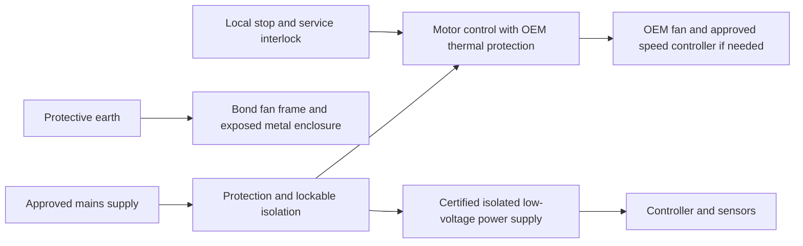

# Electrical and monitoring plan

**Current D01 control fit, 5 October:** [E05 same-module CAD/drawing and checks](../../reports/prototype_d01/electrical_package/control_module/README.md) closes assumed button-tail/service-space clashes without reducing reservations. [Current build decision](../../reports/prototype_d01/electrical_package/control_module/D01_CURRENT_BUILD_DECISION.pdf) consolidates the open release gates. Actual contact minimum ratings, button/connector stack, supports, gauges/terminals, hazard allocation and rated protection remain unverified. Default Opta relays disabled; no wiring/energization approval. Live speed adjustment not designed; disconnected-source preset is only a review proposal.

**Latest D01 supplement, 5 October:** [E01 power and wiring review](../../reports/prototype_d01/electrical_package/AQI_D01_POWER_AND_WIRING_SUPPLEMENT.pdf) and [coordination arithmetic](../../reports/prototype_d01/electrical_package/POWER_COORDINATION.json). Four-page connector-level drawing, official fan pin functions,20 assumed load/36 wire-drop examples and10 tests. Rated protection/manual restart, conductor/fuse selection and enclosure remain OPEN. This does not supersede the existing control-sequence requirements or release hardware.

**Current prototype reference, 5 October 2026:** [IH02 engineering handoff](../../reports/prototype_d01/internal_handoff_20261005/START_HERE.md) controls the D01 review: four12V P14 Max fans and proposed OEM Noctua power/control chain. The historical230V large-tower plan below is not a D01 wiring instruction. Rated protection, enclosure/harness and commissioning remain unfinished; use the current electrical appendix and release register for internal review.

PRELIMINARY FUNCTIONAL PLAN — NOT A WIRING DRAWING. 2 October 2026.

Delivery basis updated 3 October 2026: college/NGO funding only, no college lab assumed. Assistant prepares OEM-based drawings/calculations/software; ENTC review is optional/unconfirmed. Hire qualified review/assembly/commissioning where needed. See [no-lab route](NO_LAB_BUILD_ROUTE.md) and [review handout](OPTIONAL_ENTC_REVIEW.md).

The historical fan data says 230 V AC, 50 Hz, 301 W, 1.33 A, thermal contacts and a 7 microfarad capacitor. Confirm exact model and OEM diagram: AC and EC variants cannot be interchanged using old wiring. Never infer fuse/cable sizes from nominal current alone.

This diagram explains functions only. Protective devices' coordination, emergency-stop need/category, neutral handling, interlock architecture and earthing must be selected by the electrical reviewer for the actual installation. Never switch or fuse protective earth.

## Minimum functions

Outdoor thermal/ingress and tamper-access requirements are now recorded in [India deployment basis](INDIA_DEPLOYMENT_BASIS.md). D01's 40 C fan ceiling does not qualify it for hot outdoor sites. No existing enclosure or protective chain is released for rain, public access or automatic temperature shutdown.

- Qualified electrical review is required for upstream residual-current and overcurrent protection, isolator, motor-rated switching, surge measures if needed, wiring sizes, glands and terminals. The assistant prepares selection calculations from verified inputs for review. Coordinate with the actual installation supply and applicable Indian requirements; do not assume a campus site.
- OEM thermal protection remains effective. Do not bypass it to obtain higher flow. Do not connect the mains fan directly to Arduino/ESP32 GPIO or a hobby relay board; no improvised PWM mains control.
- Exposed conductive parts are bonded appropriately. Mains and low-voltage wiring are segregated, strain-relieved and guarded. Service isolation is lockable; opening a panel must not expose accessible live conductors.
- Proposed first prototype behaviour: local on/off, manual restart after power loss or safety trip, and no unattended remote start. Engineer reviews service-door interlocking and fan run-down hazards.
- Controller failure must not defeat safety functions. Wireless networking is optional and not a prerequisite for cleaning.

## Measurements

Log time, fan setting, pressure across each filter, total airflow measured by an appropriate duct traverse/flow hood method, electrical power, temperature/humidity and paired particle readings. Particle sensors are useful for trends, not certified filter leak tests. Buy appropriate monitoring instruments; hire an equipped test service or rent calibrated specialist instruments with competent operators. No college borrowing assumed.

Start with an off-the-shelf isolated logger/controller rather than a custom PCB. Select sensors only after ranges, sampling plan, accuracy and calibration access are agreed. Do not reuse the low-flow carbon laboratory instrument specification as a tower airflow specification.

## Required electrical release pack

New R00 preparation: [core operating/fault sequence and commissioning witness cases](CORE_CONTROL_SEQUENCE.md), [functional visual](CORE_ELECTRICAL_FUNCTIONS.svg) and [unreleased interface register](CORE_ELECTRICAL_INTERFACES.csv). Defines deliberate restart, access/run-down review and independent monitoring. No rated circuit or physical test has been completed.

E01 single-line diagram; E02 complete OEM-based power/control schematic; E03 terminal and cable schedule; E04 enclosure layout and earthing drawing; E05 component ratings and coordination calculation; E06 commissioning checklist. These are not yet complete: exact fan/controller, supply fault conditions, cable length, enclosure environment and protection choices remain UNKNOWN.

Before energizing, a qualified person checks protective-earth continuity, insulation and relevant leakage/protection tests, polarity/termination, thermal function, isolator/interlocks, fan rotation, guards and abnormal operation under the applicable procedures. This planning note does not specify test voltages or certify compliance.

Historical fan-only energy at 301 W for eight hours is 2.408 kWh; measured consumption including controls will govern solar planning. Do not design panels/battery/inverter from this single nominal value.

Reference: IEC 60335-2-65:2023 addresses household/similar air-cleaning appliance safety, used with Part 1. Its public scope is a review starting point, not a claim that our outdoor machine complies or that this is its only applicable standard: https://webstore.iec.ch/en/publication/70378 . Have the qualified reviewer determine classification and Indian applicability.
