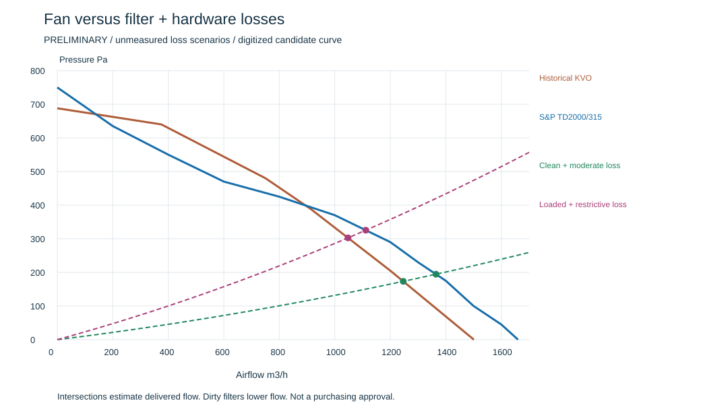

# Fan duty and packaging decision — screening, not purchase release

2 October 2026. The practical question is: **will the fan still move enough air when filters and guards resist it?** Free-air flow is not the answer.

## Current decision

Do not freeze the old KVO 250 or the new comparison candidate for procurement yet. Compare at the required minimum airflow under an approved loaded-filter condition. Current 1,200–1,300 m3/h values are study targets, not an agreed room or outdoor requirement.

The new S&P TD-2000/315 SILENT ECOWATT is a useful documented candidate for comparison, not a selected replacement. Its [official catalogue](https://statics.solerpalau.com/media/import/documentation/EN_TD-SILENT-ECOWATT.pdf) provides static-pressure curves, a dimensioned drawing, 14 kg mass and maximum absorbed power 247 W. Published free-discharge flow is 1,660 m3/h. The upright main-drawing bounding envelope used here is 432 x 373 x 825 mm; it does not include verified mounting, cable-box, adapter or service clearances. Confirm exact India variant/availability.

## Reproducible loss assumptions

Pressure-basis qualification: read [M04 air-path and pressure accounting](AIRPATH_AND_PRESSURE_BASIS.md). Hardware numbers below are illustrative allowances, not a confirmed match to the fan static-pressure test definition. Exit velocity energy must not be double-counted; actual outlet areas and installed effects remain unverified.

Run `python scripts/analysis/fan_duty_screen.py`.

For each scenario, filter pressure scales linearly with flow (unvalidated extrapolation). HEPA clean reference 111.2 Pa at 1,332 m3/h comes from the historical partial CFD interpretation, not a measured new-cassette curve. Hardware allowance scales with flow squared. It replaces the old 3.8 Pa residual—adding both would double-count part of the same allowance.

| Scenario | HEPA resistance multiplier | Prefilter Pa at 1,332 m3/h | All hardware Pa at 1,300 m3/h |
|---|---:|---:|---:|
| Clean, moderate hardware | 1 | 25 | 50 |
| Clean, restrictive hardware | 1 | 45 | 100 |
| HEPA 2x, clean prefilter | 2 | 25 | 50 |
| HEPA 2x, loaded prefilter, restrictive | 2 | 80 | 100 |

Hardware includes intake/outlet guards, transitions, ducts and relevant discharge losses. These allowances are sensitivity inputs, not a measured breakdown. Loaded multiplier and 80 Pa prefilter scenario are not approved terminal-pressure settings. No carbon bed fitted.

## Calculated comparison

| Assumed condition | Historical KVO curve m3/h | S&P digitized curve m3/h |
|---|---:|---:|
| Clean, moderate hardware | 1,246 | 1,364 |
| Clean, restrictive hardware | 1,177 | 1,274 |
| HEPA 2x, clean prefilter | 1,132 | 1,229 |
| HEPA 2x, loaded prefilter, restrictive | 1,047 | 1,111 |

These are model intersections, not promised airflow. S&P curve points were visually read from the inspected manufacturer chart (printed page 194), not supplied as certified numerical data. A +/-25 Pa chart-reading sensitivity gives about 1,078–1,144 m3/h for the last scenario; this excludes the much larger uncertainty in losses/installation. KVO variant identity remains unresolved.

## What this tells us

- A stronger comparison candidate helps, but even it falls below an illustrative 1,200 m3/h target in the restrictive loaded scenario. It is not yet evidence of adequate loaded duty.
- Maintaining 1,300 m3/h in that scenario requires about 395 Pa on the same pressure basis; candidate chart gives about 230 Pa there. Ask suppliers for a confirmed duty around 1,300 m3/h at 400 Pa as this scenario's benchmark—not as a newly proven product requirement.
- At that benchmark, Q x pressure is about 143 W of air power. Electrical input is higher and depends on efficiency and installation. A fan's wattage alone does not prove that duty; 247 W is a catalogue maximum, not predicted tower consumption.
- Larger filter area or lower-resistance fittings may reduce required head. A different fan is another route. Do not simply increase speed without OEM limits, noise/power assessment and a curve.
- Control should manage an agreed useful flow range; pressure alone cannot identify delivered flow unless calibrated against the assembled system. Maintaining speed is not the same as maintaining airflow.

Before finalizing, reconcile fan static versus total pressure and terminal velocity losses for the actual measurement planes. The circular open-plenum tower is not necessarily the manufacturer's test installation. Agree maintenance thresholds from OEM limits plus measured flow, not an arbitrary filter multiplier.

## R02 candidate packaging branch

R02 uses the drawing-informed rectangular fan bounding envelope in a hypothetical upright installation. The previous 600 mm fan allowance becomes 825 mm, so preserving its 200 mm outlet allowance increases study height from 1,990 to 2,215 mm. R01 and R00 are preserved. This is an option branch, not selection of the fan or final tower height.

Files: `cad/packaging/AQI_Cylindrical_Packaging_R02.FCStd`, corresponding `NOT_FOR_FABRICATION.step`, `PACKAGING_R02_AUDIT.json`, and `cad/parametric/cylindrical_packaging_r02.json`. The geometric checks still omit actual mounts, transitions, guards and service equipment.

Open R02 and run `scripts/geometry/view_cylindrical_packaging.FCMacro` for a clean colored view. The macro now respects an active R00/R01/R02 packaging document; with none active it defaults to R01. It changes the view only and does not save.

## Evidence and next information needed

Downloaded official catalogue is archived under `data/fans/sources/`; SHA256 and page references are in `data/fans/sp_td2000_315_silent_ecowatt_screening.json`. Source-page preview images are for internal reference, not original project drawings. Generated calculations/CSV/vector plot are under `results/fan_selection/`. Five calculation tests cover interpolation bounds, balance, load trend, chart sensitivity order and non-double-counted hardware.

Next: obtain numeric duty confirmation and exact installation CAD for an India-supported fan; select guards/transitions and replace loss allowances; obtain clean/loaded filter curves; confirm minimum acceptable flow and noise with college mentor; compare quotations and replacement costs. Only then update the selected BOM and detailed electrical circuit. No supplier contacted, component selected or purchase made.
